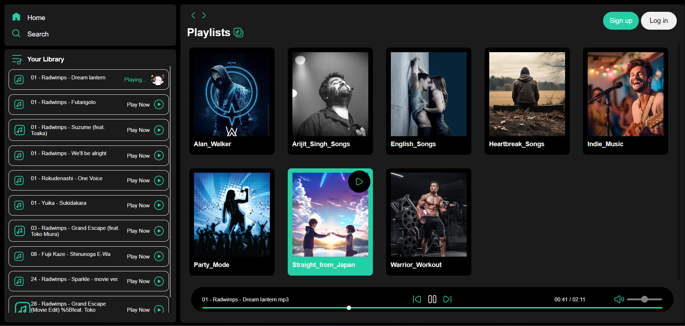
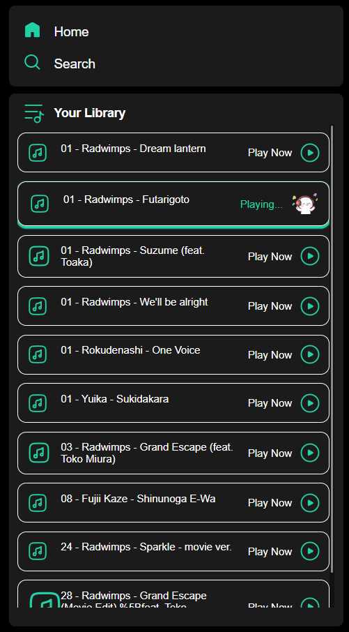
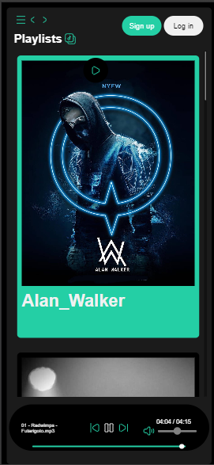
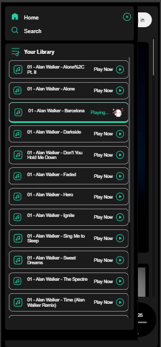

# 🔵 Project-Music-Player ( )

A fully functional music player built using pure HTML, CSS, and JavaScript. This project showcases the power of core web technologies without the use of frameworks or libraries.

## Features

- **Dynamic Playlist**: Automatically detects and loads new playlists when a playlist folder is added.
- **Responsive Design**: Works seamlessly on various devices.
- **Track Seekbar**: Seek to different parts of the track.
- **Play/Pause**: Play or pause the current track.
- **Next/Previous**: Skip to the next or previous track.
- **Volume Control**: Adjust the volume of the music.

## Screenshots

### Main Interface


### Playlist View


### Responsive Design
 <br><br> 

## Technologies Used 

- **HTML**: Structure of the application.
- **CSS**: Styling of the application, including responsive design.
- **JavaScript**: Functionality and interactivity of the music player.

## How to Use

1. **Clone the repository**:
    ```sh
    git clone https://github.com/yourusername/music-player.git
    ```
2. **Navigate to the project directory**:
    ```sh
    cd music-player
    ```
3. **Open `index.html` in your browser**:
    ```sh
    open index.html
    ```

## Learning Points

This project helped reinforce the importance of understanding the fundamentals of core web technologies. While frameworks like **React** are powerful, knowing the basics of HTML, CSS, and JavaScript is crucial as they form the foundation upon which these frameworks are built.

## Conclusion

Although this was a small project, I thoroughly enjoyed building it and learning from the process. It was a great experience to see how much can be achieved with pure HTML, CSS, and JavaScript.

Feel free to explore, use, and modify the code. Contributions and feedback are welcome!

